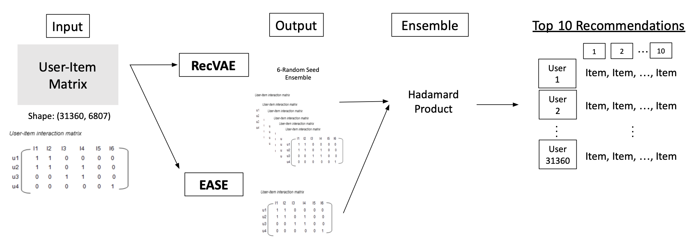

# RecSys 04 - 마음에들조
---

# Movie Recommendation : Sequential & Static recommendation

<details>
    <summary><h2>Folder Structure</h2></summary>
<div markdown="1">

```
.
├── Lexa
│   └── VASP
│       ├── MovieLens\ -\ preprocessing.ipynb
│       ├── README.md
│       ├── VASP.ipynb
│       └── utils.py
├── Phil
│   ├── EVCF
│   │   ├── README.md
│   │   ├── experiment.py
│   │   ├── models
│   │   │   ├── Baseline.py
│   │   │   ├── HVamp.py
│   │   │   ├── HVamp_1layer.py
│   │   │   ├── Model.py
│   │   │   ├── Vamp.py
│   │   │   ├── __init__.py
│   │   │   └── __pycache__
│   │   │       ├── HVamp.cpython-38.pyc
│   │   │       ├── Model.cpython-38.pyc
│   │   │       └── __init__.cpython-38.pyc
│   │   ├── requirements.txt
│   │   ├── snapshots
│   │   ├── utils
│   │   │   ├── __init__.py
│   │   │   ├── __pycache__
│   │   │   │   ├── __init__.cpython-38.pyc
│   │   │   │   ├── distributions.cpython-38.pyc
│   │   │   │   ├── evaluation.cpython-38.pyc
│   │   │   │   ├── load_data.cpython-38.pyc
│   │   │   │   ├── nn.cpython-38.pyc
│   │   │   │   ├── optimizer.cpython-38.pyc
│   │   │   │   ├── perform_experiment.cpython-38.pyc
│   │   │   │   └── training.cpython-38.pyc
│   │   │   ├── distributions.py
│   │   │   ├── evaluation.py
│   │   │   ├── load_data.py
│   │   │   ├── nn.py
│   │   │   ├── optimizer.py
│   │   │   ├── perform_experiment.py
│   │   │   └── training.py
│   │   └── vae_experiment_log_None.txt
│   ├── RecVAE
│   │   ├── LICENSE
│   │   ├── README.md
│   │   ├── __pycache__
│   │   │   ├── inference.cpython-38.pyc
│   │   │   ├── model.cpython-38.pyc
│   │   │   ├── preprocessing.cpython-38.pyc
│   │   │   └── utils.cpython-38.pyc
│   │   ├── id2profile.pkl
│   │   ├── id2show.pkl
│   │   ├── inference.py
│   │   ├── make_npz.ipynb
│   │   ├── model.py
│   │   ├── models
│   │   │   └── recvae_test.pt
│   │   ├── preprocessing.py
│   │   ├── raw_matrix.npz
│   │   ├── run.py
│   │   ├── unique_uid.pkl
│   │   └── utils.py
│   └── model
│       ├── Bestseller.ipynb
│       └── Multi-VAE.ipynb
├── Polar
│   └── Models
│       ├── CF
│       │   ├── README.md
│       │   ├── main.py
│       │   ├── requirements.txt
│       │   └── utils.py
│       ├── EASE
│       │   ├── README.md
│       │   ├── dataset.py
│       │   ├── model.py
│       │   ├── requirements.txt
│       │   ├── run.py
│       │   ├── train.py
│       │   └── utils.py
│       ├── Multi-VAE
│       │   ├── README.md
│       │   ├── dataset.py
│       │   ├── inference.py
│       │   ├── metrics.py
│       │   ├── models.py
│       │   ├── requirements.txt
│       │   ├── train.py
│       │   └── utils.py
│       ├── NGCF
│       │   ├── README.md
│       │   ├── dataset.py
│       │   ├── dataset_comp.py
│       │   ├── make_comp_graph_txt.py
│       │   ├── make_graph_txt.py
│       │   ├── metric.py
│       │   ├── metrics.py
│       │   ├── model.py
│       │   ├── requirements.txt
│       │   ├── s_adj_matrix.npz
│       │   ├── test.txt
│       │   ├── train.py
│       │   ├── train.txt
│       │   └── utils.py
│       ├── RecVAE
│       │   ├── README.md
│       │   ├── inference.py
│       │   ├── metrics.py
│       │   ├── model.py
│       │   ├── preprocessing.py
│       │   ├── requirements.txt
│       │   ├── train.py
│       │   └── utils.py
│       └── VASP
│           ├── README.md
│           ├── dataset.py
│           ├── inference.py
│           ├── loss.py
│           ├── model.py
│           ├── requirements.txt
│           ├── train.py
│           └── utils.py
├── README.md
├── Sunbi
│   ├── BiVAE
│   │   └── BiVAE.ipynb
│   ├── ESAE
│   │   └── ease.ipynb
│   ├── RecVAE
│   │   ├── LICENSE
│   │   ├── README.md
│   │   ├── __pycache__
│   │   │   ├── inference.cpython-38.pyc
│   │   │   ├── model.cpython-38.pyc
│   │   │   ├── preprocessing.cpython-38.pyc
│   │   │   └── utils.cpython-38.pyc
│   │   ├── inference.py
│   │   ├── model.py
│   │   ├── models
│   │   │   ├── recvae_e110_n0_ldim400.pt
│   │   │   └── recvae_test.pt
│   │   ├── preprocessing.py
│   │   ├── run.py
│   │   └── utils.py
│   ├── implicit
│   │   └── als.ipynb
│   └── model
│       ├── Bestseller.ipynb
│       └── Multi-VAE.ipynb
├── Youngha
│   ├── Baseline
│   │   ├── datasets.py
│   │   ├── inference.py
│   │   ├── models.py
│   │   ├── modules.py
│   │   ├── preprocessing.py
│   │   ├── run_pretrain.py
│   │   ├── run_train.py
│   │   ├── sample_submission.ipynb
│   │   ├── trainers.py
│   │   └── utils.py
│   ├── MF_ALS
│   │   ├── CML.ipynb
│   │   ├── MF.py
│   │   ├── best_config_als.txt
│   │   ├── implicit_als.py
│   │   └── raytune_als.py
│   ├── PyG
│   │   ├── LinkProp.ipynb
│   │   ├── lightgcn.ipynb
│   │   ├── torchgeo.ipynb
│   │   ├── torchgeo_exp.ipynb
│   │   └── torchgeo_old.ipynb
│   └── RayTune
│       ├── Raytuned.ipynb
│       ├── best_config_multiaae.txt
│       ├── train_multiaae.py
│       └── train_multivae.py
└── ensemble.py
```
  
</div> 
</details>


## 대회 소개 및 개요

추천 시스템에서 많이 활용되는 MovieLens 데이터 셋을 implicit data의 형태로 재가공하여 진행된 movie recommendation 대회입니다. 실제 영화를 추천하는 환경에서는 유저의 영화 소비 패턴을 기반으로 영화를 추천하는 과정과 전체 소비 패턴을 sequential의 관점으로 학습하여 영화르 추천합니다.  
이 두 가지의 관점을 모두 연습할 기회르 만들고자 이번 대회에서는 각 사용자별로 9개의 영화를 중간중간 masking 하였고 최종 마지막 데이터 1개를 masking하여 총 10개의 아이템을 추천하는 것이 목적입니다.

## 데이터

- 전체 영화의 수 : 6807
- 전체 유저의 수 : 31360
- 유저가 본 영화의 기록이 남으므로 데이터 자체가 implicit feedback을 갖고 있음
  
## 모델



- 2개 모델 아키텍쳐를 앙상블
- Non-linear Model
  - Architecture : RecVAE
  - Dataset : User-Item implicit Matrix
  - Optimizer : Adam
  - Criterion : MSELoss + KLD
- Linear Model
  - Architecture : EASE (not Neural EASE)
  - Dataset : User-Item implicit Matrix
  - EASE do not use Optimizer and loss function
- Ensemble
  - Seed different Model ensemble (Bagging Concept)
  - σ(EASE) ⨀ (RecVAE seed ensemble)

## 결과

- Public LB Recall@10 : 0.1632
- Private LB Recall@10 : 0.1637
- Top 5
